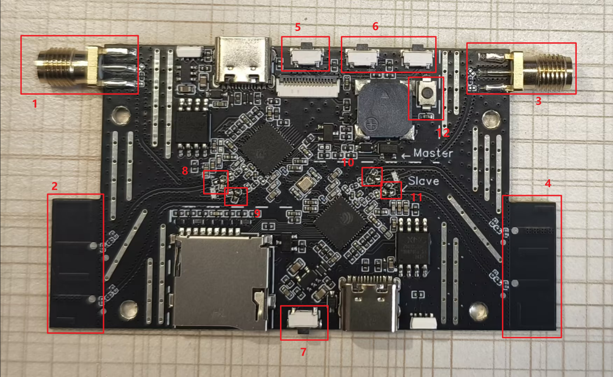
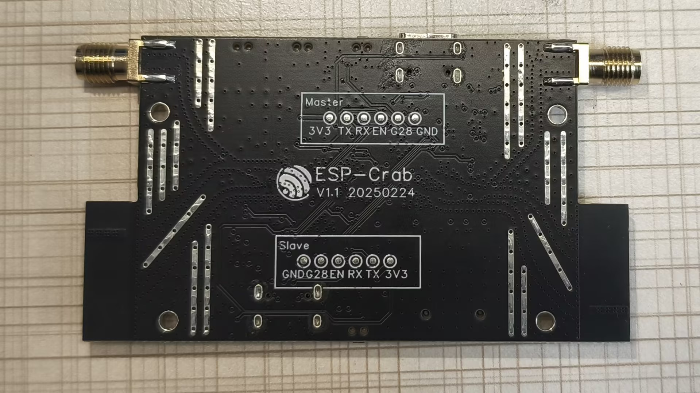
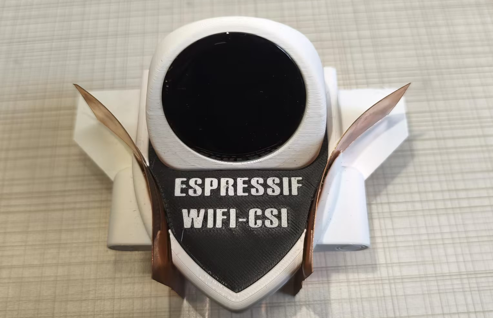

# 共晶振CSI接收示例

* [English Version](./README.md)

此示例提供了一种 Wifi-CSI 的射频相位同步解决方案，包含三个子项目：MASTER_RECV（主接收端）、SLAVE_RECV（从接收端）、SLAVE_SEND（从发送端）。
该方案包含两种工作模式：1、自发自收模式；2、单发双收模式

## 功能介绍

### 1. 自发自收模式

在该模式下，两片 ESP32-C5 芯片分别发送和接收信号，通过计算接收 Wi-Fi CSI 信号中的相位信息，可以毫米级地感知射频信号路径中的扰动。同时，通过安装铜片控制射频信号的传输路径，也可以调节感知范围，从而为高精度的近距离 Wi-Fi 感知提供技术支持。这种模式使得 Wi-Fi 信号感知更加精细，适用于近距离和复杂环境中的精确感知应用。


#### 1.1 MASTER_RECV（主接收端）

将 `MASTER_RECV` 固件烧录至 `esp-crab` 设备的 **Master** 芯片，其功能包括：

* 接收来自 `SLAVE_SEND` 端的 WiFi 数据包，并提取数据中的 **CIR (Channel Impulse Response)** 信息。
* 基于接收到的 CIR 信息，计算 Wifi-CSI 的 **幅度和相位**，并将结果显示。

#### 1.2 SLAVE_SEND（从发送端）

将 `SLAVE_SEND` 固件烧录至 `esp-crab` 设备的 **Slave** 芯片，其功能包括：

* 发送特定的wifi数据包。

### 2. 单发双收模式

此模式下，一片 ESP32-C5 芯片负责发送信号，而 `esp-crab` 的两片 ESP32-C5 芯片则负责接收信号。通过分散部署发送端和接收端，可以在 **大范围空间** 内实现 Wi-Fi 感知。`esp-crab` 获取的 **共晶振 Wi-Fi CSI 信息** 能够满足前沿研究中的 Wi-Fi 感知性能需求，并且可以直接对接成熟的高级算法，进一步提升无线感知系统的 **精度和应用价值**。该模式为 **大范围、复杂环境下的无线感知和定位** 提供了强大的技术支撑。

  

#### 2.1 MASTER_RECV（主接收端）

将 `MASTER_RECV` 固件烧录至 `esp-crab` 设备的 **Master** 芯片，其功能包括：

* 通过天线接收来自 `SLAVE_SEND` 的 Wi-Fi 数据包，并提取 **CIR 信息**。
* 同时接收来自 `SLAVE_RECV` 的 CIR 信息（该信息由从接收端的天线收集）。
* 计算 Wi-Fi CSI 的 **幅度和相位差值**，并将结果显示。

#### 2.2 SLAVE_RECV（从接收端）

将 `SLAVE_RECV` 固件烧录至 `esp-crab` 设备的 **Slave** 芯片，支持以下两种模式：

* 通过天线接收来自 `SLAVE_SEND` 的 Wi-Fi 数据包，并提取 **CIR 信息**。
* 将接收到的 CIR 信息发送到 `MASTER_RECV`。

#### 2.3 SLAVE_SEND（从发送端）

将 `SLAVE_SEND` 固件烧录至额外的 **ESP32-C5 芯片**（例如 `ESP32-C5-DevkitC-1`），其功能包括：

* 发送特定的 Wi-Fi 数据包。

## 所需硬件

### `esp-crab` 设备

#### PCB介绍  

射频相位同步解决方案需要运行在 `esp-crab` 设备上，下面的图片显示了PCB的正面和背面。

| 序号 | 功能                     |
|------|--------------------------|
| 1    | Master 外接天线          |
| 2    | Master 板载天线          |
| 3    | Slave 外接天线           |
| 4    | Slave 板载天线           |
| 5    | Master BOOT 按键         |
| 6    | Master ADC 按键          |
| 7    | Slave BOOT 按键          |
| 8    | Master 2.4G天线切换电阻  |
| 9    | Master 5G天线切换电阻    |
| 10   | Slave 5G天线切换电阻     |
| 11   | Slave 2.4G天线切换电阻   |
| 12   | RST 按键                 |




参考 [PCB V1.1](doc/PCB_ESP_CRAB_ESP32C5_V1_1.pdf) 和 [SCH V1.1](doc/SCH_ESP_CRAB_ESP32C5_V1_1.pdf) 查看PCB的原理图和PCB。

#### 形态介绍

`esp-crab` 设备根据功能的不同，具有两种外壳形式，

* 自发自收模式的飞船外形

* 单发双收模式的飞船外形


### `ESP32-C5-DevkitC-1`开发板

单发双收模式需要一个`ESP32-C5-DevkitC-1`开发板作为wifi发送端。

## 如何使用样例

### 1. 自发自收模式

自发自收模式只要为 `esp-crab` 通过 Type-c 供电，就可以开始工作，`esp-crab` 即会显示CIS的幅度和相位信息。

* 幅度信息：两条曲线分别为 -Nsr~0 和 0~Nsr 对应CIR的幅度信息。
* 相位信息：曲线为标准正弦曲线，曲线与屏幕中心红线的交点为 0~Nsr 对应CIR的相位信息。

同时`esp-crab`会在串口打印接收到的 `CSI` 数据，按 `type,id,mac,rssi,rate,noise_floor,fft_gain,agc_gain,channel,local_timestamp,sig_len,rx_state,len,first_word,data` 顺序打印如下所示的数据。

```text
CSI_DATA,3537,1a:00:00:00:00:00,-17,11,159,22,5,8,859517,47,0,234,0,"[14,9,13,10,13,11,13,12,17,13,16,14,16,16,16,16,15,18,17,17,17,21,15,20,16,22,17,23,15,25,16,23,17,21,13,25,15,23,14,21,17,24,16,22,16,21,19,20,18,21,17,18,18,20,17,20,17,21,18,19,18,18,20,19,19,15,19,17,21,16,21,16,21,15,22,13,24,14,24,11,23,9,24,9,25,9,25,7,25,9,26,7,26,6,24,5,26,6,26,4,26,3,28,2,28,2,29,2,30,-1,28,-1,24,-3,0,0,0,0,0,0,-6,-28,-7,-28,-5,-28,-7,-28,-6,-28,-9,-26,-9,-26,-10,-27,-12,-27,-10,-24,-10,-23,-11,-25,-13,-24,-16,-22,-17,-25,-16,-22,-20,-21,-19,-20,-18,-23,-17,-19,-18,-16,-21,-19,-19,-17,-19,-17,-23,-18,-21,-17,-22,-13,-22,-13,-23,-14,-24,-14,-23,-12,-24,-14,-23,-13,-25,-12,-24,-11,-28,-12,-24,-11,-25,-10,-27,-10,-25,-12,-26,-10,-26,-10,-26,-12,-29,-11,-27,-12,-25,-11,-23,-13,-22,-12,-20,-14,-21,-13,-20,-13,-18,-11,-14,-13,-16,-11,-13,-11,-12,-10,-11,-11]"
```

> 注：上电设备会采集前一百个wifi包来确定wifi射频接收增益。

### 2. 单发双收模式

单发双收模式要为 `esp-crab` 和 `ESP32-C5-DevkitC-1` 供电，并布置在有一定距离的空间内，`esp-crab` 即会显示CIS的幅度和相位信息。同时`esp-crab`会在串口打印接收到如前文所示的 `CSI` 数据。
